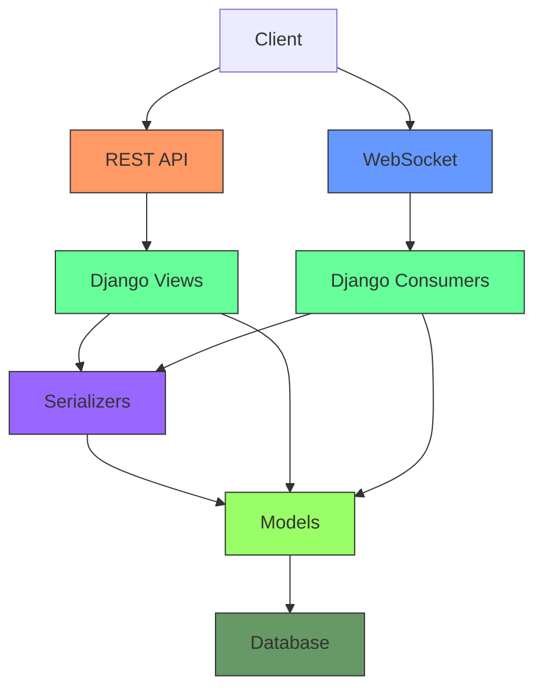

# Architecture Overview

## System Architecture

The system architecture combines REST API and WebSocket communication to provide both traditional HTTP endpoints and real-time updates. The REST API is built with Django REST Framework and follows resource-based design principles, with endpoints for routes, buses, locations, and stops. The WebSocket functionality is implemented using Django Channels, allowing clients to receive real-time updates about bus locations without polling. The architecture is configured through ASGI, which enables both HTTP and WebSocket protocols to coexist in the same application.

## Backend Architecture

The backend is built with Django and Django REST Framework, providing a robust API for managing bus routes, buses, and locations. Key components include:

- **Routes**: Define bus routes with stops and scheduling information
- **Buses**: Represent individual buses with identifiers and current status
- **Locations**: Store GPS location data for buses at specific timestamps
- **Route Stops**: Define stops along each route with geographic coordinates

## Frontend Architecture

The frontend is built with React and Leaflet, providing an interactive map interface for visualizing bus locations in real-time. Key components include:

- **BusMap**: Interactive map component displaying bus locations and routes
- **BusList**: List component showing detailed information about buses
- **RouteSelector**: Component for filtering buses by route

## Communication Patterns

The system uses both HTTP/REST and WebSocket communication patterns:

- **HTTP/REST**: Used for initial data loading, CRUD operations, and administrative functions
- **WebSocket**: Used for real-time updates of bus locations

