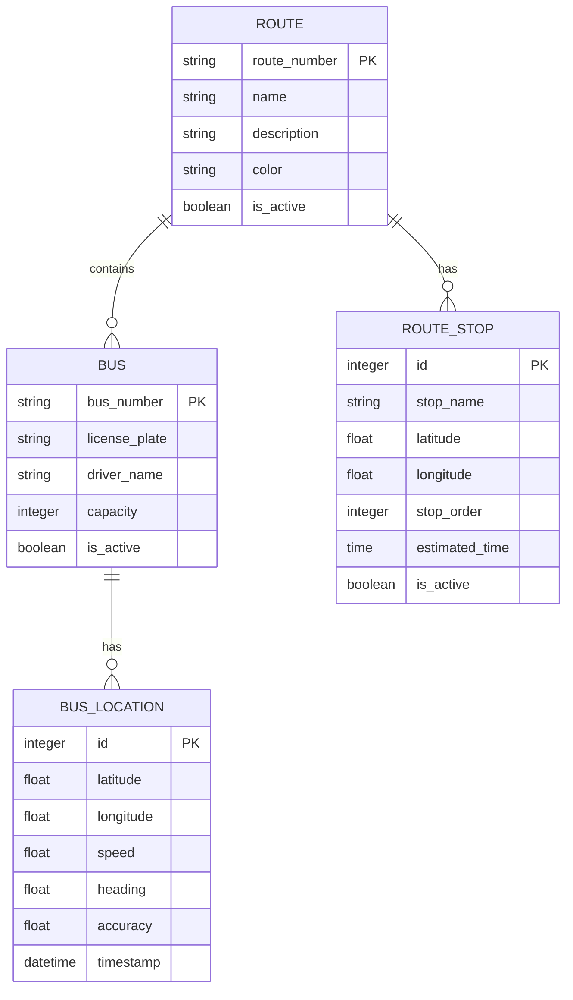

# Backend Architecture

## Data Models & Relationships

The data models form the foundation of the application, defining the structure and relationships between entities in the bus tracking system.

### Model Relationships



## API Endpoints Reference

The backend provides RESTful API endpoints for managing the various entities in the system:

- **Routes API**: Manage bus routes
- **Buses API**: Manage individual buses
- **Locations API**: Handle bus location data
- **Route Stops API**: Manage stops along routes

## Serializers Implementation

Django REST Framework serializers handle the conversion between Python objects and JSON representations for API responses. Custom serializers optimize data payloads for real-time transmission.

## WebSocket Implementation

The ASGI configuration in `asgi.py` sets up a `ProtocolTypeRouter` that directs incoming connections based on their protocol type. HTTP requests are routed to the standard Django ASGI application, while WebSocket connections are handled by an `AuthMiddlewareStack` wrapped around a `URLRouter`. This router delegates WebSocket connections to specific consumers based on URL patterns defined in the `buses.routing` module.

```python
application = ProtocolTypeRouter({
    "http": get_asgi_application(),
    "websocket": AuthMiddlewareStack(
        URLRouter(
            websocket_urlpatterns
        )
    ),
})
```

## Admin Interface Configuration

The Django admin interface provides a powerful administrative interface for managing the application's data. Custom admin classes enhance the interface with specialized views and actions for managing buses, routes, and locations.