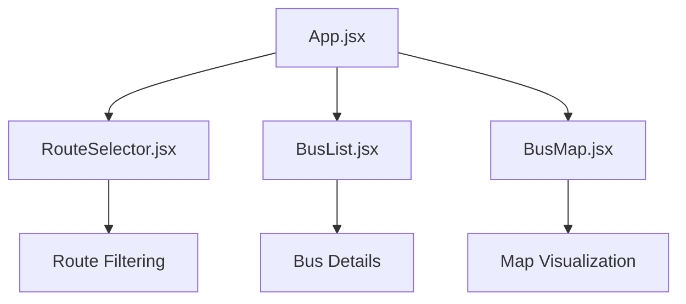

# Frontend Architecture

## Component Hierarchy

The frontend application follows a component-based architecture with React. The main components include:

- **App**: Root component that manages global state and routing
- **BusMap**: Interactive map component displaying bus locations and routes
- **BusList**: List component showing detailed information about buses
- **RouteSelector**: Component for filtering buses by route

## State Management Approach

The application follows a unidirectional data flow pattern where state is lifted to the App component and passed down through props. Real-time updates are handled via a singleton WebSocket service that broadcasts location updates to all interested components. This architecture enables efficient state synchronization without requiring complex global state management solutions.

## Service Layer Architecture

The frontend uses a service layer to handle API calls and WebSocket connections:

- **api.js**: Handles HTTP requests to the REST API
- **websocket.js**: Manages WebSocket connections for real-time updates

## Map Integration with Leaflet

The interactive map visualization is built around several core components that work together to display real-time bus tracking data. The BusMap component serves as the central visualization element, rendering a full-screen Leaflet map with OpenStreetMap tiles and overlaying dynamic bus markers. It integrates with the api.js service to fetch initial route and bus data, and with websocket.js to receive real-time location updates. The component hierarchy follows the React-Leaflet pattern with MapContainer as the root, containing TileLayer for base maps, and Marker components for bus locations.