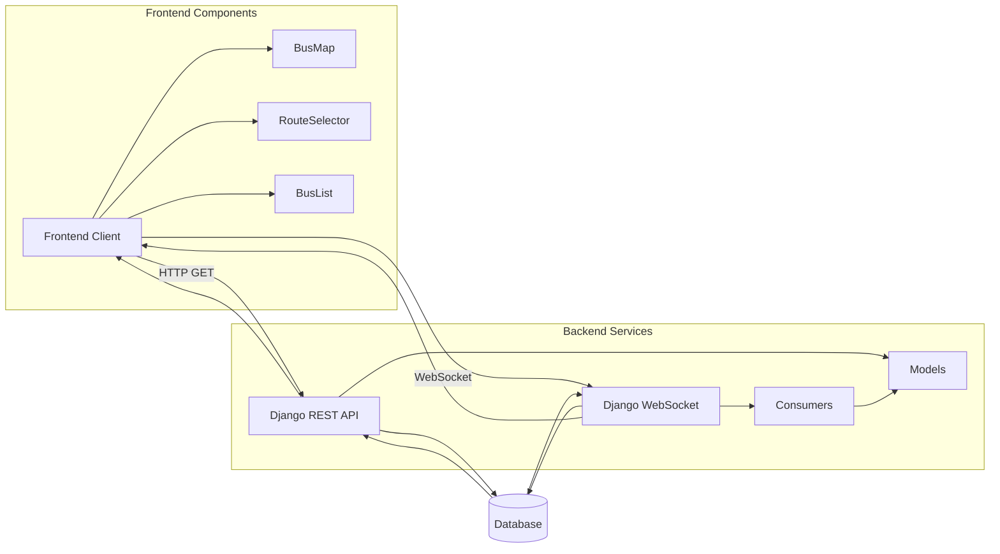

# Real-time Tracking System

## WebSocket Implementation

The WebSocket implementation enables real-time communication between the server and connected clients. The system uses Django Channels to handle WebSocket connections, allowing for scalable real-time updates.

## Frontend WebSocket Service

The frontend WebSocket service manages persistent connections and handles message processing. Key features include:

- **Connection Management**: Establishes and maintains WebSocket connections
- **Message Handling**: Processes incoming location updates
- **Reconnection Logic**: Automatically reconnects if the connection is lost
- **Error Handling**: Gracefully handles connection errors

## Data Simulation and Flow

The system includes a simulation script that generates realistic bus movement data for testing and demonstration purposes. The simulation:

- Updates bus locations at regular intervals
- Calculates realistic speeds and headings
- Follows predefined routes
- Generates location history data

## Real-time Data Flow Architecture

The real-time data flow follows this sequence:

1. **Data Generation**: Either from real GPS devices or simulation
2. **Data Processing**: Server processes and validates location data
3. **Broadcasting**: Updated locations are broadcast to connected clients
4. **Client Update**: Frontend receives updates and refreshes the display

