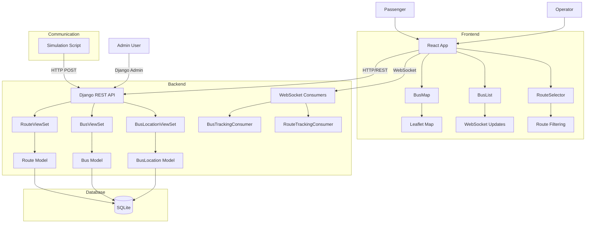

# System Overview

## Core Components

The Django-Geo-Vide system follows a modern full-stack architecture with clear separation between frontend and backend components. The backend provides a RESTful API using Django REST Framework, while the frontend consumes this API and displays data through interactive components.

## Architecture Overview

The Django-Geo-Vide system follows a modern full-stack architecture with clear separation between frontend and backend components. The backend provides a RESTful API using Django REST Framework, while the frontend consumes this API and displays data through interactive components.

## Simulation and Testing

Deploying the Django-Geo-Vide system for production use requires several configuration changes to ensure security, performance, and reliability. The development configuration prioritizes ease of setup, but production deployment necessitates adjustments to critical settings.

Security settings must be updated by setting DEBUG = False and configuring proper ALLOWED_HOSTS to include the production domain. The current configuration allows all CORS origins, which should be restricted to specific domains in production. A strong SECRET_KEY should be used and stored securely, preferably through environment variables.

For WebSocket functionality, Redis should be used as the channel layer backend in production instead of the in-memory layer used in development.
